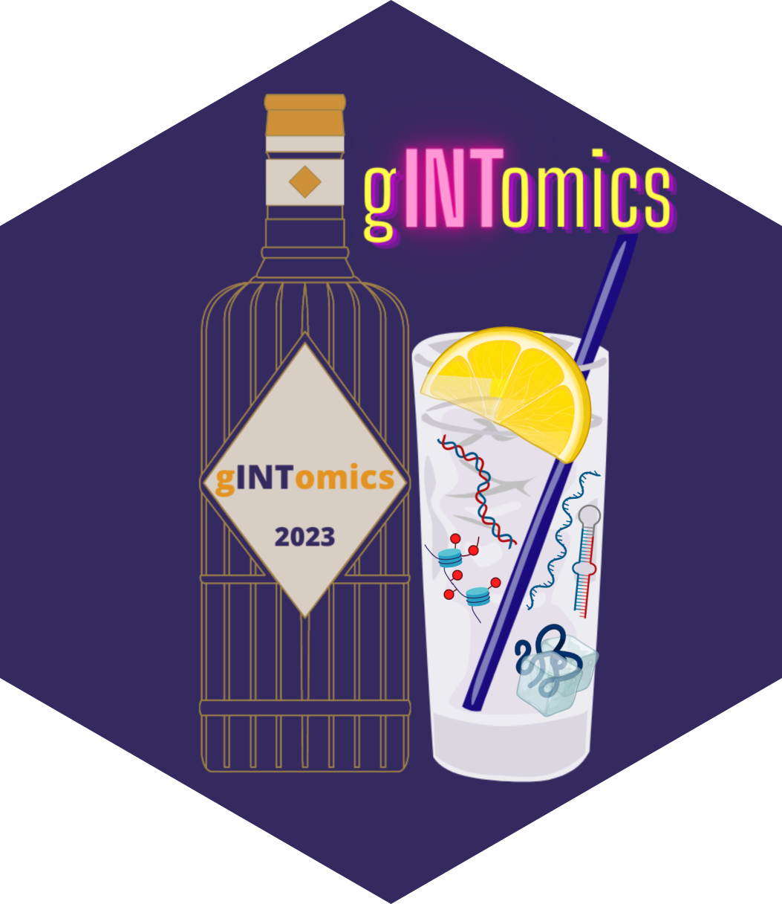
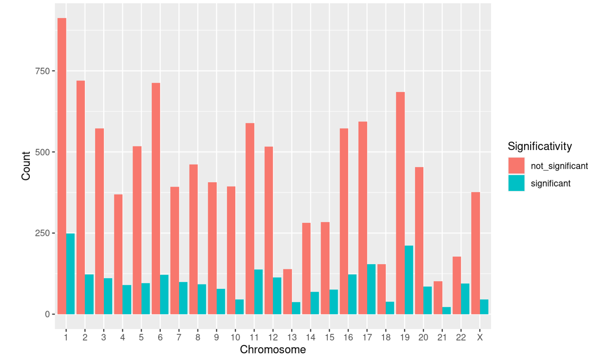
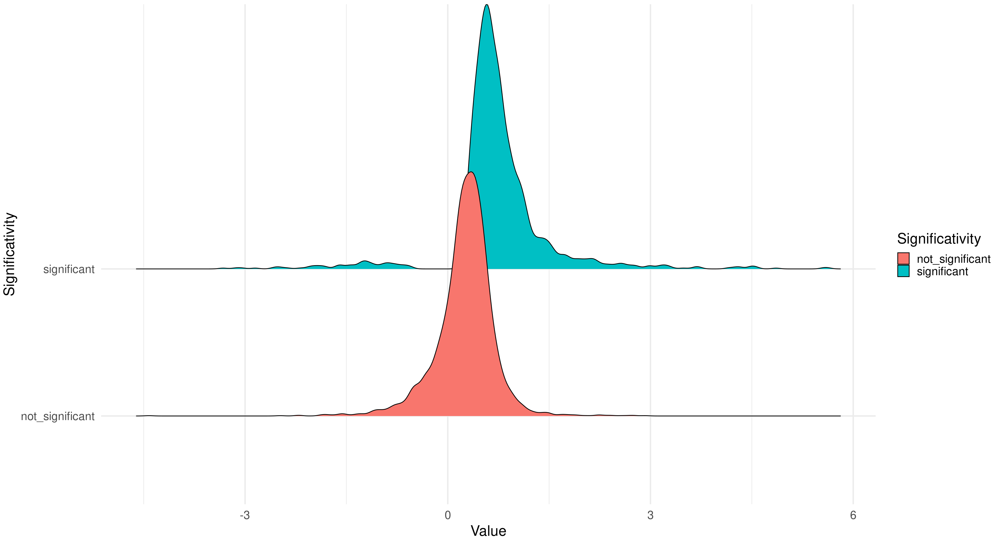
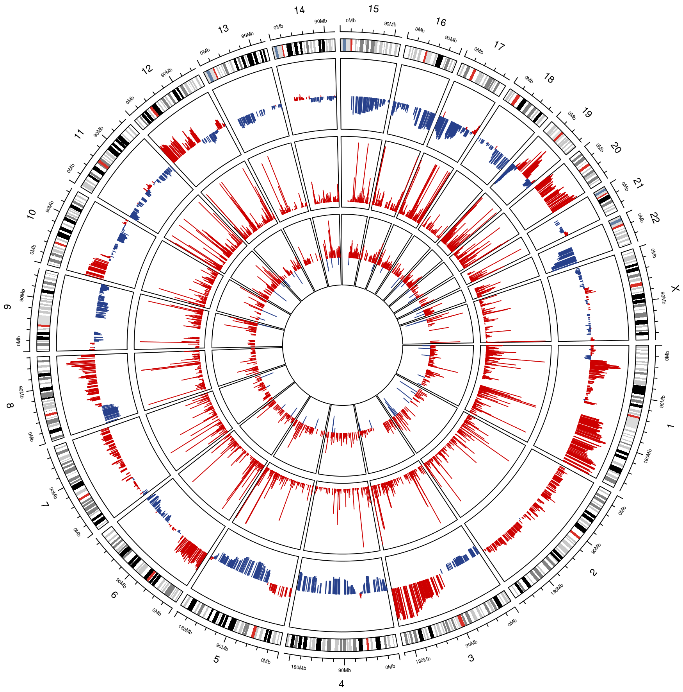

 gINTomics is an R package for Multi-Omics data integration and visualization. gINTomics is designed to detect the association between the expression of a target and of its regulators, taking into account also their genomics modifications such as Copy Number Variations (CNV) and methylation. For RNA sequencing data, the counts will be fitted using a negative binomial model, while in the case of microarray or other types of data, a linear model will be applied. In some cases the number of regulators for a given target could be very high, in order to handle this eventuality, we provide a penalized linear model that will automatically keep only the most important regulators. All the models are gene-specific, so each gene/miRNA will have its own model with its covariates. The package will automatically download information about TF-target couples (dorothea), miRNA-target couples (multiMiR) and TF-miRNA couples (TransmiR). The couples will be used to define the covariates used in the integration models.


# Installation
To install this package:

``` r
devtools::install_github("angelovelle96/gINTomics")
```

# How to use gINTomics

In the following section, we use an example MultiAssayExperiment of ovarian cancer to show how to use `gINTomics` with a standard workflow. The object contains all the available input data types: Gene expression data, miRNA expression data, gene methylation data, gene Copy Number Variations and miRNA Copy Number Variations.

## Generate a MultiAssayExperiment

The package contains a pre built MultiAssayExperiment, anyway in this section we will divide it in signle omics matrices and see how to build a proper MultiAssayExperiment from zero.

``` r
# loading packages
library(gINTomics)
library(MultiAssayExperiment)
data("ov_test_tcga_omics")
``` 

Here we will extract the single omics from the MultiAssayExperiment
``` r
gene_exp_matrix <- as.matrix(assay(mmultiassay_ov[["gene_exp"]]))
miRNA_exp_matrix <- as.matrix(assay(mmultiassay_ov[["miRNA_exp"]]))
meth_matrix <- as.matrix(assay(mmultiassay_ov[["methylation"]]))
gene_cnv_matrix <- as.matrix(assay(mmultiassay_ov[["cnv_data"]]))
miRNA_cnv_matrix <- as.matrix(assay(mmultiassay_ov[["miRNA_cnv_data"]]))
``` 

Now let's build a proper MultiAssayExperiment starting from single matrices

``` r
new_multiassay <- create_multiassay(methylation = meth_matrix, 
                                    gene_exp = gene_exp_matrix,
                                    cnv_data = gene_cnv_matrix,
                                    miRNA_exp = miRNA_exp_matrix,
                                    miRNA_cnv_data = miRNA_cnv_matrix)
``` 


## Run CNV integration

In this section we will see how to perform an expression-CNV integration. The input data (for both expression and CNV) should be provided as matrices or data.frames. Rows represent samples, while each column represents the different response variables/covariates of the models. Expression data could be both normalized or not normalized, the function is able to normalize data by setting the `normalize` argument to TRUE (default). If you want you can specify custom interaction through the `interactions` argument otherwise  the function will automatically look for the genes of `expression` in `cnv_data`.

``` r
gene_cnv_integration <- run_cnv_integration(expression = t(gene_exp_matrix),
                                            cnv_data = t(gene_cnv_matrix))
``` 


## Run methylation integration

In this section we will see how to perform an expression-methylation integration. The input data should be the same of `run_cnv_integration`, but the covariates matrix will contain methylation data instead of Copy Number Variations data. Expression data could be both normalized or not normalized, the function is able to normalize data by setting the `normalize` argument to TRUE (default). If you want you can specify custom interaction through the `interactions` argument otherwise  the function will automatically look for the genes of `expression` in `methylation`.

``` r
gene_met_integration <- run_met_integration(expression = t(gene_exp_matrix),
                                            methylation = t(meth_matrix))


```

## Run TF-target integration

In this section we will see how to perform an expression-TF integration. In this case you can use as input data a single gene expression matrix if both your TF and targets are genes and are contained in the gene expression matrix. If you want the package to automatically download the interactions between TFs and targets you have to set the argument `type` to "tf". Otherwise you can also specify your custom interactions providing them with the `interactions` argument. You can handle data normalization as in the previous functions through the `normalize` argument. This function is designed to integrate TF expression data but it can handle every type of numerical data representing a gene expression regulator. So you can pass the regulators matrix to the `tf_expression` argument and specify your custom `interactions`. If expression data are not obtained through sequencing, remember to set `sequencing data` to FALSE.

``` r
tf_target_integration <- run_tf_integration(expression = t(gene_exp_matrix),
                                            type = "tf")

```


## Run miRNA-target integration

In this section we will see how to perform an expression-miRNA integration. Gene expression data will be provided through the `expression` argument while miRNA expression data through the `tf_expression` argument. Input matrices should follow the same rules of the previous functions. If you want the package to automatically download the interactions between miRNA and targets you have to set the argument `type` to "miRNA_target". Otherwise you can also specify your custom interactions providing them with the `interactions` argument. You can handle data normalization as in the previous functions through the `normalize` argument.

``` r
miRNA_target_integration <- run_tf_integration(expression = t(gene_exp_matrix),
                                               tf_expression = t(miRNA_exp_matrix),
                                               type = "miRNA_target")

```


## Run TF-miRNA integration

In this section we will see how to perform an miRNA-TF integration. miRNA expression data will be provided through the `expression` argument while gene expression data through the `tf_expression` argument. Input matrices should follow the same rules of the previous functions. If you want the package to automatically download the interactions between TF and miRNA you have to set the argument `type` to "tf_miRNA". Otherwise you can also specify your custom interactions providing them with the `interactions` argument. You can handle data normalization as in the previous functions through the `normalize` argument.

``` r
tf_miRNA_integration <- run_tf_integration(expression = t(miRNA_exp_matrix),
                                               tf_expression = t(gene_exp_matrix),
                                               type = "tf_miRNA")
```


## Run complete Multi-Omics integration

Finally we will see how to perform a complete integration using all the available omics. In order to run this function you need to generate a MultiAssayExperiment as showed at the beginning of this vignette. The function will automatically use all the omics contained in the MultiAssayExperiment to perform all the possible integrations showed before. Moreover, if CNV data are available, the first step will be the expression-CNV integration and all the following integrations that contain expression data as response variable will use instead the residuals of the expressionCNV model in order to filter out the effect of CNV.

``` r
multiomics_integration <- run_multiomics(data = new_multiassay)

```

## Visualization

Now let's see how you can visualize the results of your integration models.

### Chromosome distribution plot

This barplot highlights the distribution of significant and non significant covariates among chromosomes. This kind of visualization will identify chromosomes in which the type of regulation under analysis is particularly active. You can pass to the function both the MultiOmics object returned by the `run_multiomics` function or the result of one of the integration functions.

``` r
chr_distribution_plot(multiomics_integration)

```
<p align="center">

</p>

### Ridgeline plot

The ridgeline plot is designed to compare different distributions, it has been integrated in the package with the aim to compare the distribution of significant and non significant coefficients returned by our integration models. . Also in this case, you can pass to the function both the MultiOmics object returned by the `run_multiomics` function or the result of one of the integration functions.

``` r
ridgeline_plot(multiomics_integration)

```
<p align="center">

</p>

### Circos plot

Circos plots are an incredible resource in terms of data visualization and summarization, they allow to visualize different omics on a genomic scale and to compare them across different layers. In this example we have the average Copy Number Variation across all samples in the external layer, the average gene expression in the middle and the significant coefficients of the Expression-CNV integration model in the internal layer. The blue bars represent negative values, while red represents positive values. You can pass to the function one of the results contained by the MultiOmics object returned by `run_multiomics` or the result of one of the integration functions. At the moment the complete MultiOmics object is not supported as input.

``` r
circos_plot(multiomics_integration$gene_cnv_res)

```
<p align="center">

</p>

